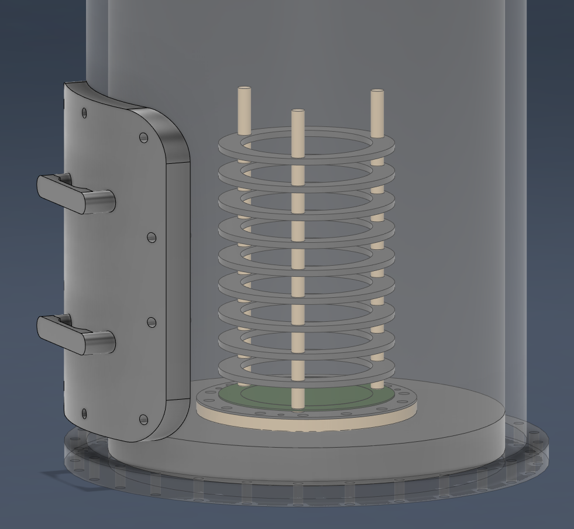

# Comb.Mod.SAQ.Pix

## Overview  
  
This is the current status of the **"new"** SAQ Model build. I have included field cage rings so that if needed, we can export the model to simulation.  
  
## Current Assets   
⚠️ - **[Pixel Combs](/1.KiCAD/Pixel.Combs):** ./1.KiCAD/Pixel.Combs  
   
img updated: 5/12/2023   
Geometry:  
(Outer Radius) : 39 mm  
(Inner Radius) : 30 mm  
  
--------------  
⚠️ - **[Collection Board](/1.KiCAD/Feed.Through.Adapter/):** ./1.KiCAD/Feed.Through.Adapter  
**1-  Non-Metallic**  
  
The PCB Component of our collection component.  
**2.  Metallic**  
  
  
  
__Combined__  
Top of readout adapter  
  
Bottom of readout adapter  
  
  
<a href="https://www.digikey.com/en/products/detail/mill-max-manufacturing-corp/0906-1-15-20-75-14-11-0/1147049">Pogo Pins used for design [Digi-Key]</a>  
img updated: 5/15/2023  
  
--------------  
🟠 - **[Steel Vessel](/2.Fusion360/Vessel):** ./2.Fusion360/Vessel/Smooth.SAQ.Pix.Vessel.5.15.2023     
   
img updated: 5/15/2023  
  
Vessel still needs to be changed for other feedthroughs. Similarly to the door will be a multiple outlet one on the side, and some at the top of the vessel.  
  
--------------- 
## Planned Development
📝 - Dummy Signal Board  
📝 - [19 Channel SAQ Board] or [2-Two Channel, 2-Four Channel, 1-Five Channel]  
📝 - Source Holder  

---------------

|   Legend       |  Meaning                      |
|----------------|-------------------------------|
|📝| This component is in the design and illustration phase            |
|🟠| This component is under development            |
|⚠️| This component requires feedback before further development |
|🟡| This component files are under final review |
|🟢| This component is ready for production |

