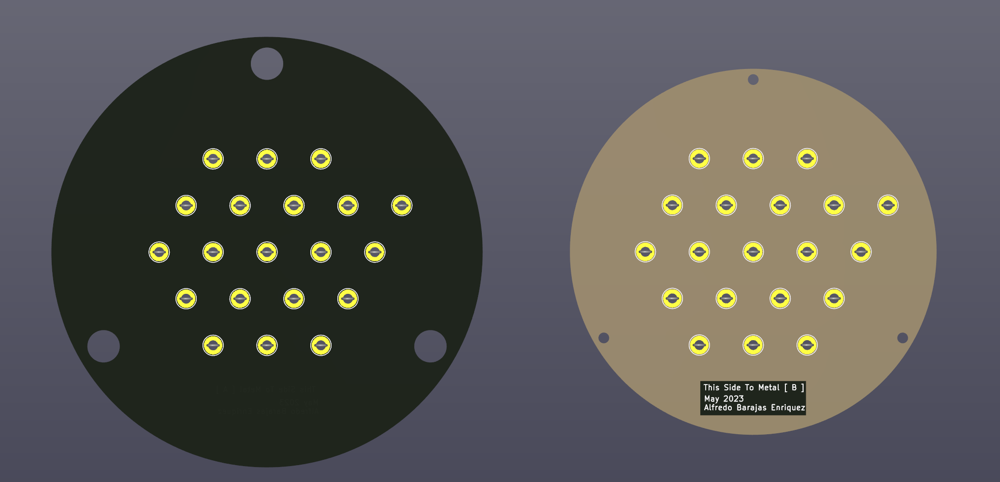
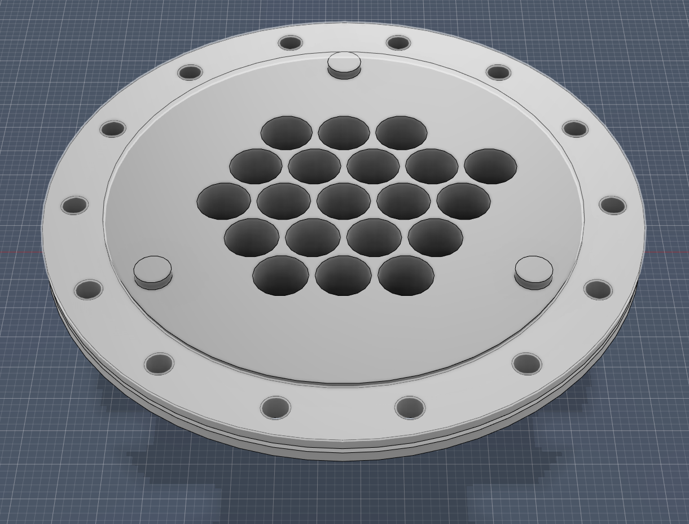
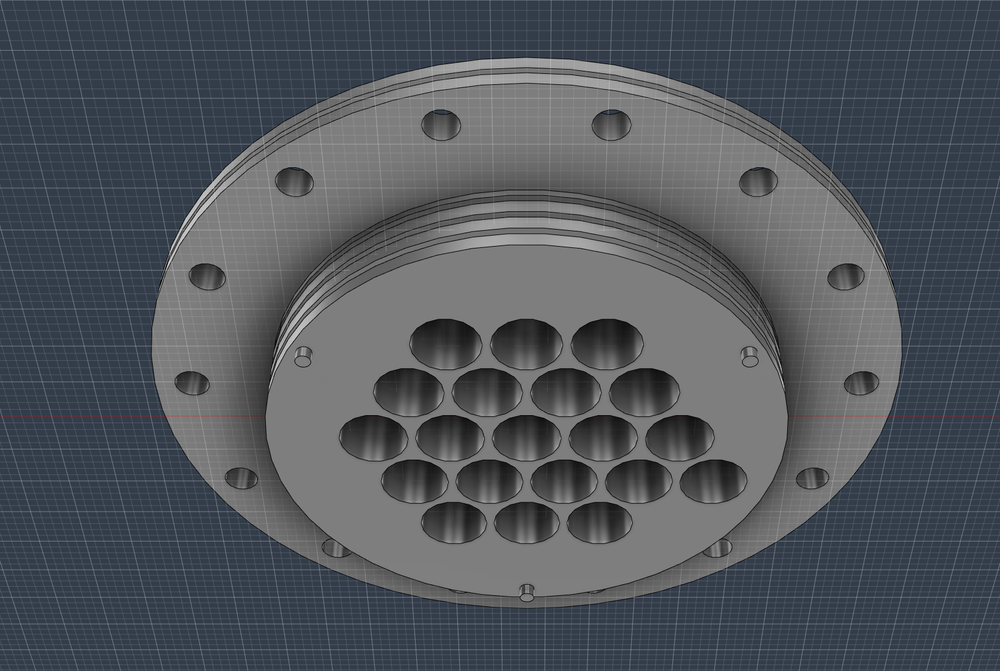
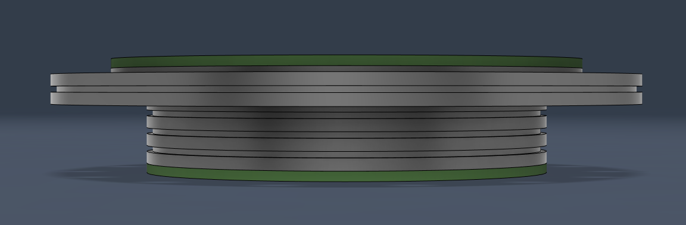
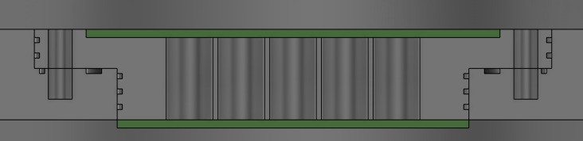
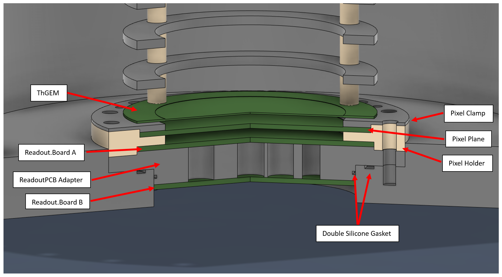

# Comb.Mod.SAQ.Pix

|   Legend       |  Meaning                      |
|----------------|-------------------------------|
|📝| This component is in the design and illustration phase            |
|🟠| This component is under development            |
|⚠️| This component requires feedback before further development |
|🟡| This component files are under final review |
|🟢| This component is ready for production |

## Finished Developments  
  
## Current Developments  
### 1.KiCAD :  
🟠 - **[Pixel Combs](/1.KiCAD/Pixel.Combs):** ./1.KiCAD/Pixel.Combs  
   
img updated: 5/12/2023   
Geometry:  
(Outer Radius) : 39 mm  
(Inner Radius) : 30 mm  
  
--------------
  
🟠 - **[Collection Board](/1.KiCAD/Pixel.Collection.Board):** ./1.KiCAD/Pixel.Collection.Board  
Consisting Parts :  
1.  Non-Metallic
  
The PCB Component of our collection component.
2.  Metallic
  
  
  
  Combined
  
  
  

   
<a href="https://www.digikey.com/en/products/detail/mill-max-manufacturing-corp/0906-1-15-20-75-14-11-0/1147049">Recommended Pogo Pins [Digi-Key]</a>  
img updated: 5/12/2023  
  
--------------
  
🟠 - **[Steel Vessel](/2.Fusion360/Vessel):** ./2.Fusion360/Vessel/Smooth.SAQ.Pix.Vessel.5.10.2023     
   
img updated: 5/10/2023  

Assets :  
  3 Piece door lock  
  This will change, I am going to reduce it to 2 pieces.  
   
.  
 Image of Ring Cage, ThGEM, and PCB Adapter  
   
  
---------------

   
## Planned Development

📝 - Pixel Holder  
📝 - Dummy Signal Board  
📝 - 19 Channel SAQ Board  
📝 - Source Holder  
