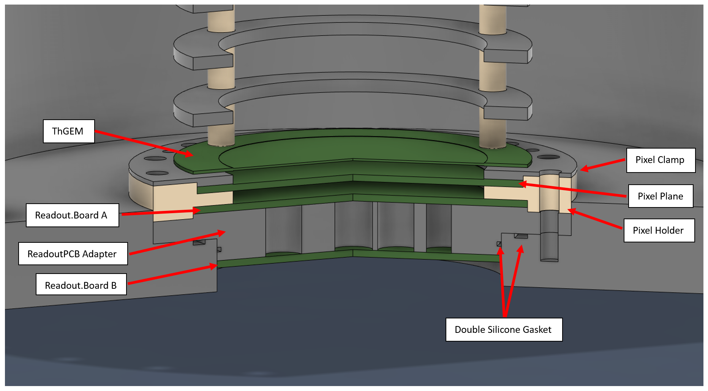
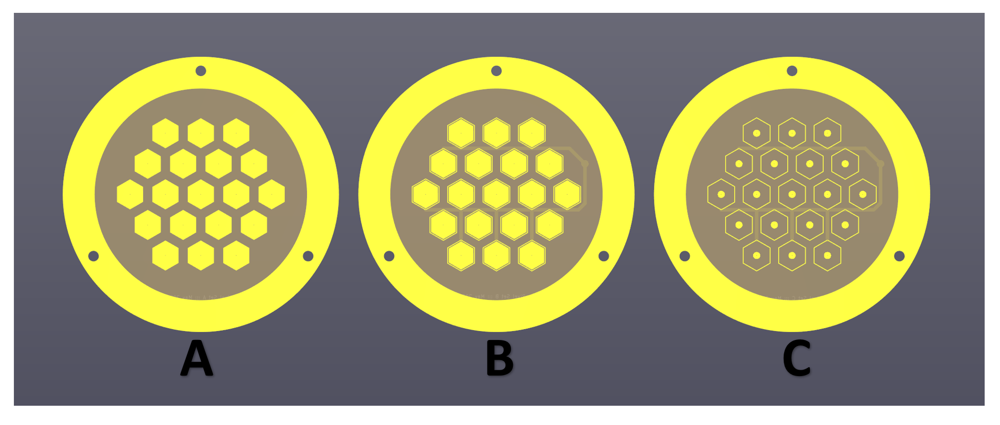
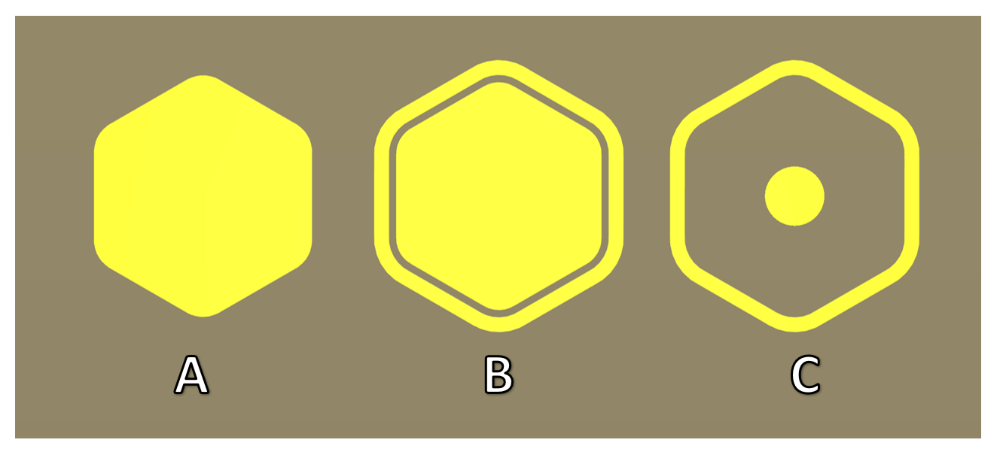
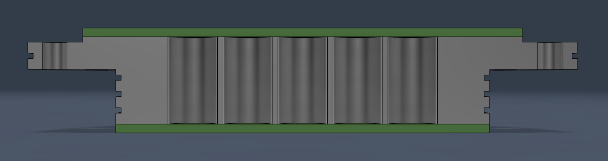
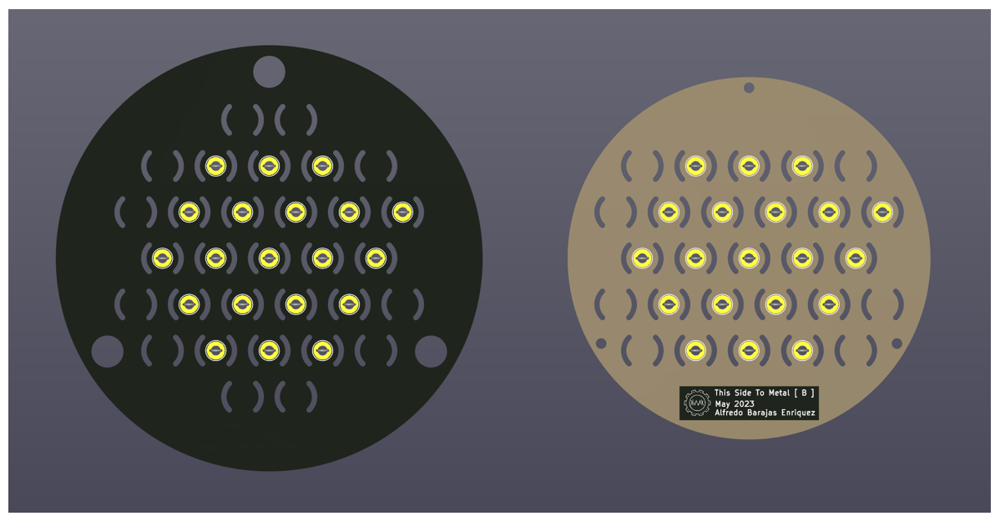
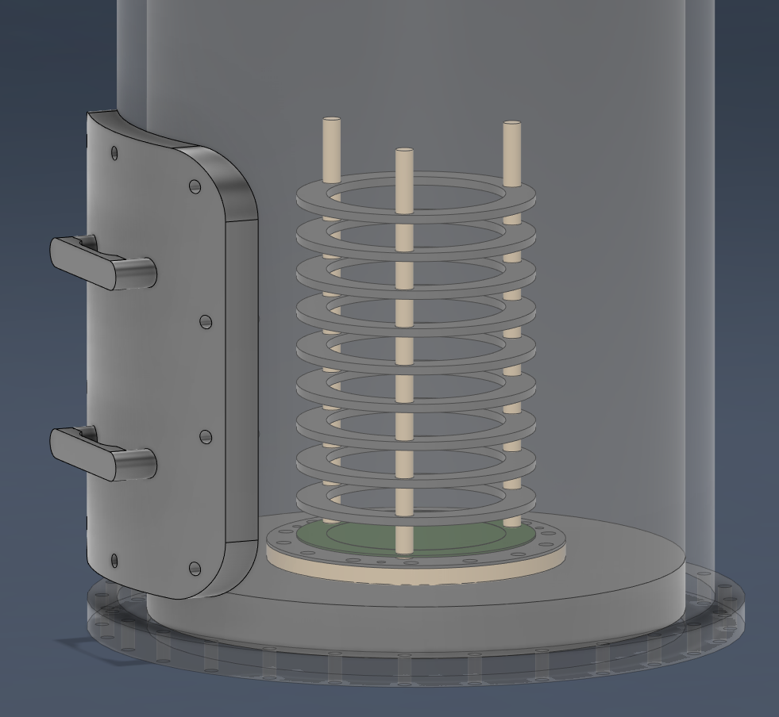
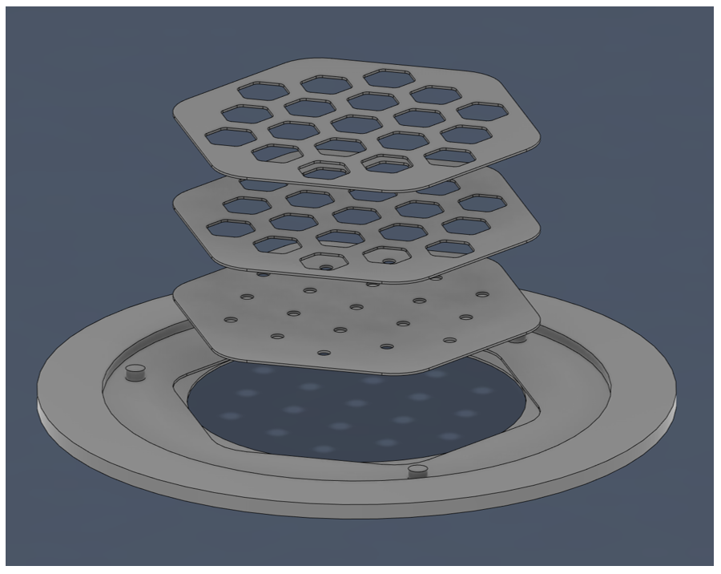
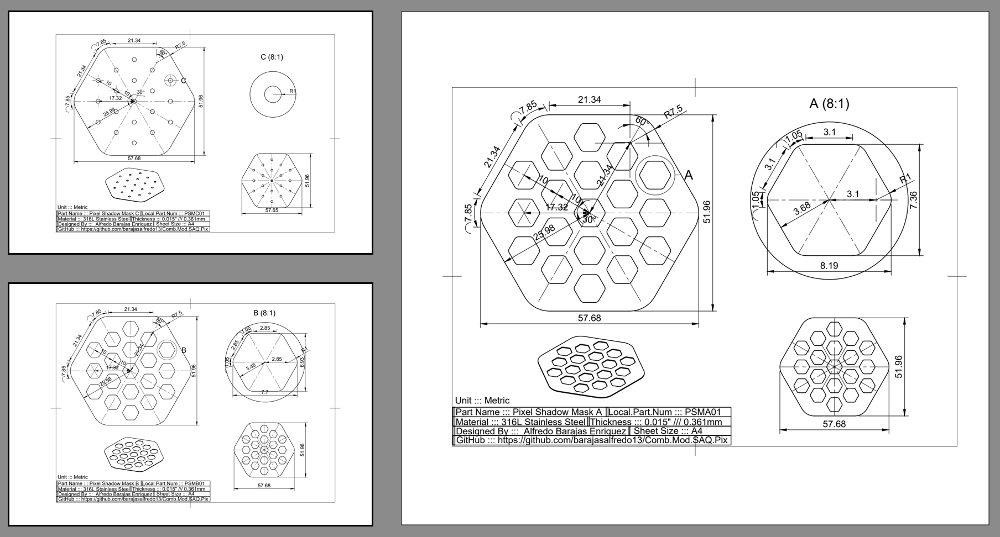

# Comb.Mod.SAQ.Pix
::: Important Notes :::  
I am remaking the models to more organized individual projects. That way if others other than the creator need to be modify it, it is easy to do so.  

✨::: Updates :::✨
- Individual Feedthrough Fusion360 was generated  
- Designed, Modeled, and created Drawings for Pixel Shadow Masks.  
- Smoothed pixels so that they match shadow masks  
- Labeled Pixel Tiles with Letter Codes so that they match the Stencil Letters.  
- Added more information on geometries and descriptions.  
- Reorganized files by function type.  
- Minor Design Fixes  
  
♨️:::Extra Info:::♨️  
- Drawing of Stencil Holder and [Pixel Shadow Masks] becomes complete  
- Drawing of Readout Adapter and [Readout Feedthrough] become complete  
  
  
  
This is a demo photo of the current system design.    
  
## Table of Contents  
- [Current Assets]
  - 🟢[Pixel Combs] ✨
  - 🟠[Readout Feedthrough] ✨
  - 🟠[Steel Vessel]
- [Planned Development]
  - 📝[19 Channel SAQ Board] or [2-Three Channel, 2-Four Channel, 1-Five Channel]
  - 📝[Source Holder] 
- [Research and Development Tools]
  - 🟠[Pixel Shadow Masks] ✨
- [Optional Testing Equipment]
  - 🟢[Channel Tester] ✨
- [Icon Legend]
  
  
## Current Assets   
### 🟢 - **[Pixel Combs](/Modular.Pixel.Combs/):** ./Modular.Pixel.Combs/  
  
  
:: Base Geometry and Dimensions ::  
PCB.Dimensions : 78 x 78 mm  
PCB.Thickness : 1.6 mm  
(Outer Radius) : 39 mm  
(Inner Radius) : 30 mm  
Pixel Pitch : 10 mm  
  
  
  
Pixel Description :::  
A- Solid Single Conductive Plane Hexagon  
B- Solid Single Conductive Plane Hexagon with Single Biased Hexagon Ring  
C- Solid Single Circular Plane with Single Biased Hexagon Ring  
  
::: Intended Use :::  
Pixel Comb planes were designed to be used as experimental collection planes for specific interactions. With use of shadow masks, we can deposite materials to experimentally test. measure and characterize novel materials.  
   
   
--------------  
### ✨🟠 - **[Readout Feedthrough](/Readout.Feed.Through.Adapter/):** ./Readout.Feed.Through.Adapter/  
  
  
**Description of the PCB Component**  
  
:: Base Geometry and Dimensions ::  
PCB.Dimensions : [A] 80 x 80 mm ::: [B] 68 x 68 mm  
PCB.Thickness : [A] 1.6 mm  ::: [B] 1.6 mm  
  
  
<a href="https://www.digikey.com/en/products/detail/mill-max-manufacturing-corp/0906-1-15-20-75-14-11-0/1147049">Pogo Pins used for design [Digi-Key]</a>  
  
#### ::: Assembly Instructions :::  [Pictures and Diagrams Coming soon]  
Note: Each PCB should have text on which side faces the metal, additionally they are keyed.  
1- Solder (Avoid Zinc Based Solders) Pogo Pins and a necessary amount of wire so that you have enough cable to go through the metallic component.  
2- Clean all components in an ethanol bath and store in a clean area.  
3- Prepare enough epoxy to fill the holes in the metal part of the readout adapter.  
4- Align the PCB with the wires and secure firmly to the metal adapter.  
5- Flip the device over and pour epoxy to the top.  
6- While epoxy is still wet, align the wires and place the second PCB.  
7- Secure tightly and allow to dry for the recommended time.   
 
  
--------------  
### 🟠 - **[Steel Vessel](/Vessel.Full/Fusion360/):** ./2.Fusion360/Vessel/Smooth.SAQ.Pix.Vessel.5.15.2023     
   
img updated: 5/15/2023  
  
Vessel will be modified so that Standardized Feedthroughs can be used.   
  
--------------- 
## Planned Development
📝 - [19 Channel SAQ Board] or [2-Three Channel, 2-Four Channel, 1-Five Channel]  
📝 - Source Holder   
  
  
---------------  
## Research and Development Tools  
### ✨🟠 - **[Pixel Shadow Masks](/Shadow.Mask.Kit/Fusion360/)** ./Shadow.Mask.Kit/Fusion360/  
    
  Material ::: 316L Stainless Steel   
  Shadow Mask Thickness ::: [ 0.015 in // 0.381 mm ]  
    
  
316L Stainless Steel was chosen due to its low outgassing and resistiveness to corrosion  
  
:: [Drawings](/Shadow.Mask.Kit/Drawings/) ::  
  

----------------  
## Optional Testing Equipment  
  
### ✨🟡- **[Channel Tester](/Channel.Tester/KiCAD/):** ./Channel.Tester/KiCAD  
   
  
#### How to Use
Note: The Channel Tester has the same dimensions of a pixel board  
1- Insert the Channel Tester board and secure it like a pixel board.  
2- Send test signals in a labeled slot, record the channel triggered  
  ex: Slot A receives input, channel 7 is triggered. -> A7  
3- When each letter has a number assigned, you can begin tests.  
  
  
---------------  
## Icon Legend  
|   Legend       |  Meaning                      |
|----------------|-------------------------------|
|✨| Recently Updated / New Items            |
|📝| This component is in the design and illustration phase            |
|🟠| This component is under development            |
|⚠️| This component requires feedback before further development |
|🟡| This component files are under final review |
|🟢| This component's design is final |

