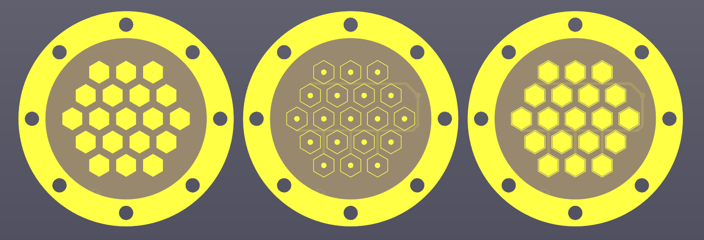
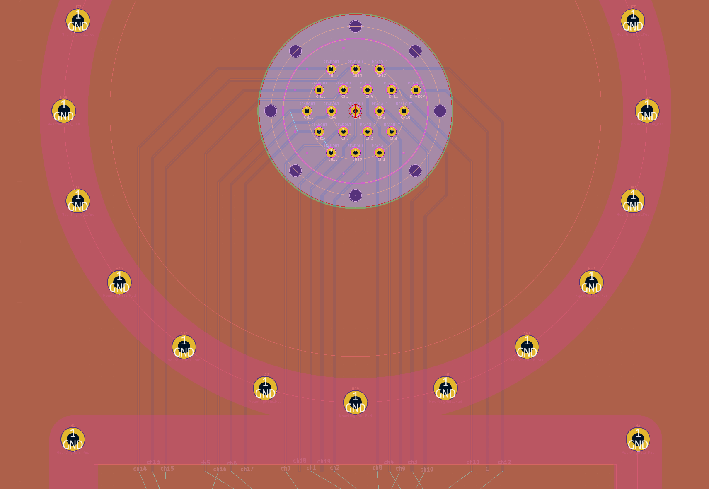
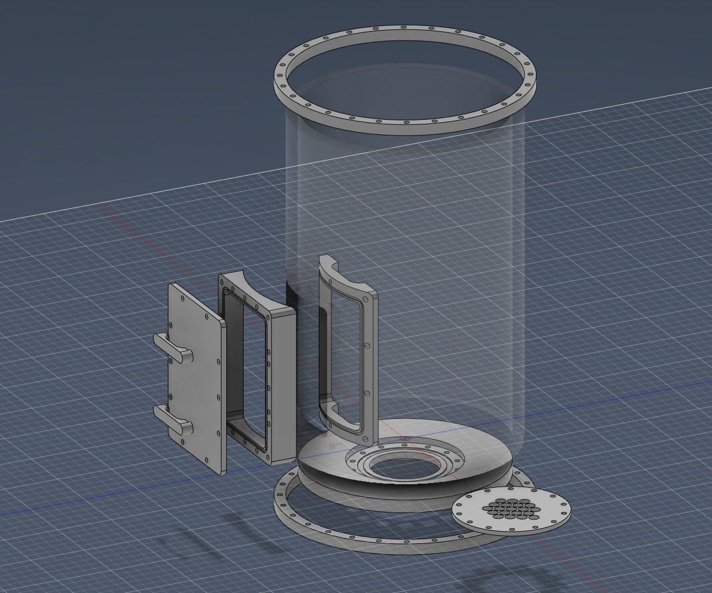
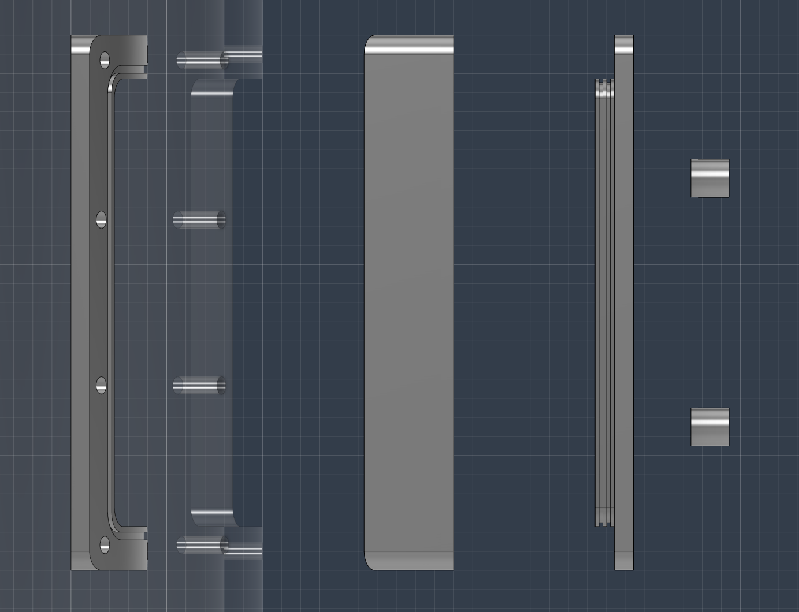
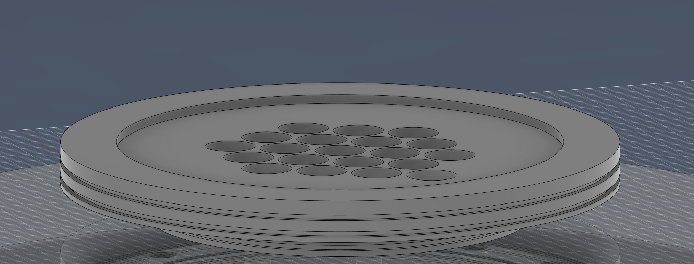
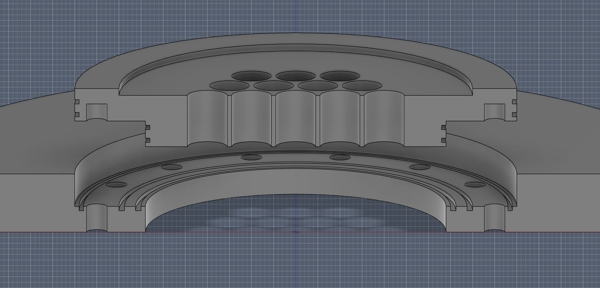

# Comb.Mod.SAQ.Pix

|   Legend       |  Meaning                      |
|----------------|-------------------------------|
|📝| This component is in the design and illustration phase            |
|🟠| This component is under development            |
|⚠️| This component requires feedback before further development |
|🟡| This component files are under final review |
|🟢| This component is ready for production |

## Finished Developments  
  
## Current Developments  
### 1.KiCAD :  
🟠 - **[Pixel Combs](/1.KiCAD/Pixel.Combs):** ./1.KiCAD/Pixel.Combs  
   
img updated: 5/2/2023   
Geometry:  
(Outer Radius) : 40 mm  
(Inner Radius) : 30 mm  
  
--------------
  
🟠 - **[Collection Board](/1.KiCAD/Pixel.Collection.Board):** ./1.KiCAD/Pixel.Collection.Board  
   
img updated: 5/2/2023  
  
Note :  
Will likely be removed and instead consisting of 2 PCB Board layers with 1 [Readout PCB Adapter] between glued with Torr Vaccum Epoxy  
--------------
  
🟠 - **[Steel Vessel](/2.Fusion360/Vessel):** ./2.Fusion360/Vessel/Smooth.SAQ.Pix.Vessel.5.10.2023    
**[🌐 3D Online Viewer](/ReadMeAssets/Files/SAQ.Vessel.stl)**  
   
img updated: 5/10/2023  

Assets :  
  3 Piece door lock  
   
.  
  Readout PCB Adapter  
   
.  
 1 mm gasket traces  
   
  
---------------

   
## Planned Development

📝 - Dummy Signal Board  
📝 - 19 Channel SAQ Board  
📝 - Source Holder  
