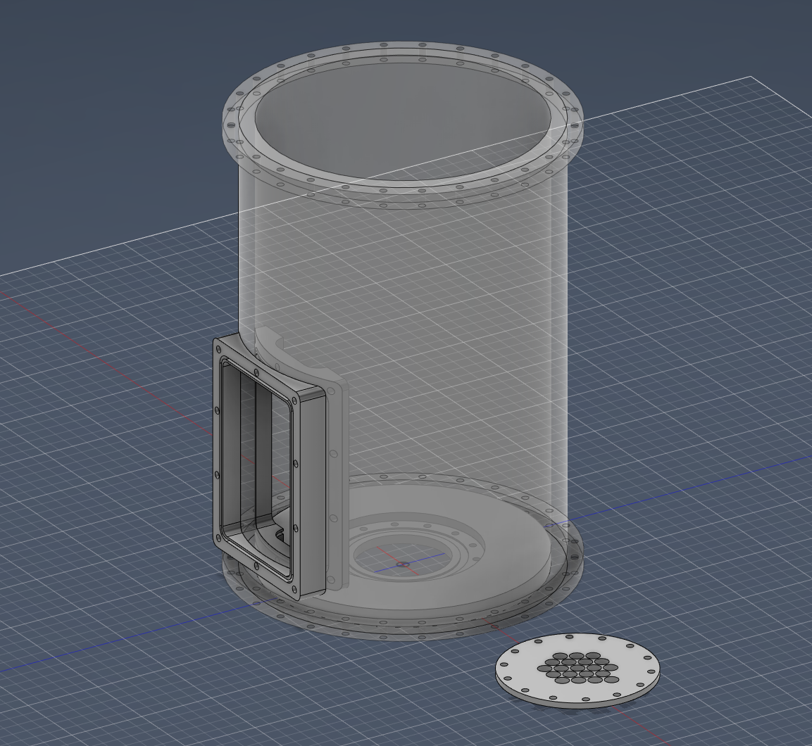

# Comb.Mod.SAQ.Pix

|   Legend       |  Meaning                      |
|----------------|-------------------------------|
|📝| This component is in the design and illustration phase            |
|🟠| This component is under development            |
|⚠️| This component requires feedback before further development |
|🟡| This component files are under final review |
|🟢| This component is ready for production |

## Finished Developments

## Current Developments
### 1.KiCAD : 
🟠 - **[Pixel Combs](/1.KiCAD/Pixel.Combs):** ./1.KiCAD/Pixel.Combs  
   

Geometry:  
(Outer Radius) : 40 mm
(Inner Radius) : 30 mm
(Key Cut Radius) : 5 mm

img updated: 5/2/2023  
  
🟠 - **[Collection Board](/1.KiCAD/Pixel.Collection.Board):** ./1.KiCAD/Pixel.Collection.Board  
   
img updated: 5/2/2023  

🟠 - **[Steel Vessel 1](/2.Fusion360/Vessel):** ./2.Fusion360/Vessel/SAQ.Pix.Vessel.5.2.2023  
   
img updated: 5/2/2023  

- **[Steel Vessel 2](/2.Fusion360/Vessel):** ./2.Fusion360/Vessel/Smooth.SAQ.Pix.Vessel.5.9.2023.   
   
img.updated: 5/7/2023  

Note:  Currently I am thinking of two designs for the steel vessel. The first design will not need a redesign of the first vessel. The second design will reduce the size of the collection board and will be exchangable as long as a support is built for it. The support item has been standardized so that it is not difficult to upgrade for larger channel support   
   
## Planned Development

📝 - Dummy Signal Board  
📝 - 19 Channel SAQ Board  
📝 - Source Holder  
