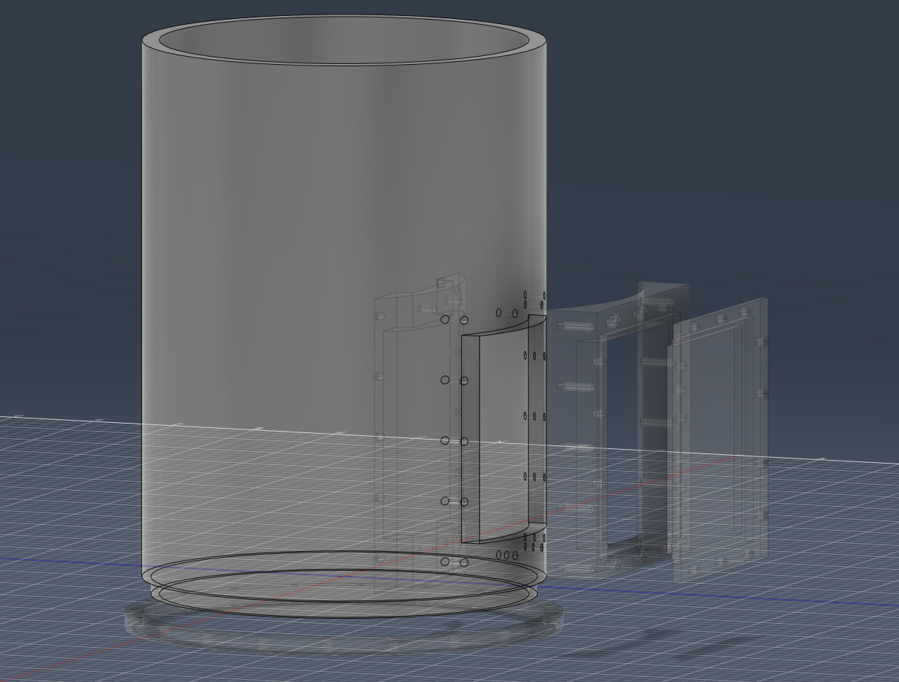

# Comb.Mod.SAQ.Pix

|   Legend       |  Meaning                      |
|----------------|-------------------------------|
|📝| This component is in the design and illustration phase            |
|🟠| This component is under development            |
|⚠️| This component requires feedback before further development |
|🟡| This component files are under final review |
|🟢| This component is ready for production |

## Finished Developments

## Current Developments
### 1.KiCAD : 
⚠️- **[Pixel Combs](/1.KiCAD/Pixel.Combs):** ./1.KiCAD/Pixel.Combs  
   
img updated: 5/2/2023  
  
🟠 - **[Collection Board](/1.KiCAD/Pixel.Collection.Board):** ./1.KiCAD/Pixel.Collection.Board  
   
img updated: 5/2/2023  

🟠 - **[Steel Vessel](/2.Fusion360/Vessel):** ./2.Fusion360/Vessel  
   
img updated: 5/2/2023  
  
## Planned Development

📝 - 19 Channel SAQ Board
📝 - Source Holder
